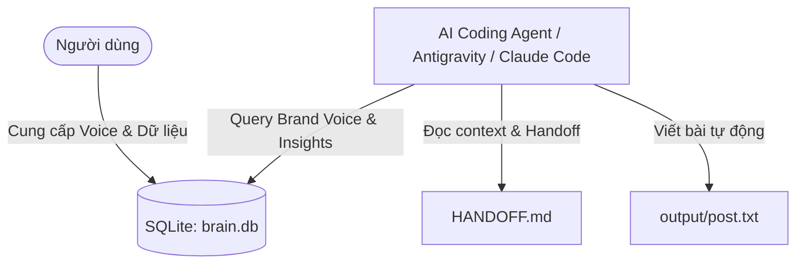

# Architecture & Data Model

Hệ sinh thái Second Brain hoạt động cục bộ trên máy tính của người dùng (Local First), đảm bảo quyền riêng tư và tốc độ truy xuất cao.

## 1. Luồng dữ liệu (Data Flow)

## 2. Mô hình cơ sở dữ liệu (SQLite: `brain.db`)

Database gồm 3 bảng chính:

### Bảng `knowledge`
Lưu trữ các bài học, đúc kết, insights và kiến thức chuyên môn:
- `id`: INTEGER PRIMARY KEY AUTOINCREMENT
- `title`: TEXT NOT NULL
- `content`: TEXT NOT NULL
- `created_at`: TIMESTAMP DEFAULT CURRENT_TIMESTAMP

### Bảng `business`
Lưu trữ thông tin sản phẩm, dịch vụ, khách hàng mục tiêu và USP:
- `id`: INTEGER PRIMARY KEY AUTOINCREMENT
- `title`: TEXT NOT NULL
- `content`: TEXT NOT NULL
- `created_at`: TIMESTAMP DEFAULT CURRENT_TIMESTAMP

### Bảng `brand_voice`
Lưu trữ định vị giọng văn, từ khoá yêu thích, từ ngữ kiêng kỵ và bài viết mẫu:
- `id`: INTEGER PRIMARY KEY AUTOINCREMENT
- `title`: TEXT NOT NULL
- `content`: TEXT NOT NULL
- `created_at`: TIMESTAMP DEFAULT CURRENT_TIMESTAMP

## 3. Nguyên tắc hoạt động
- **Local-first**: Toàn bộ dữ liệu nằm trên máy local.
- **Agent Handoff**: Mọi agent trước khi làm việc phải đọc `HANDOFF.md` và sau khi xong phải cập nhật `HANDOFF.md`.
- **Git Versioning**: Mọi thay đổi đều được lưu vết qua Git commit.
